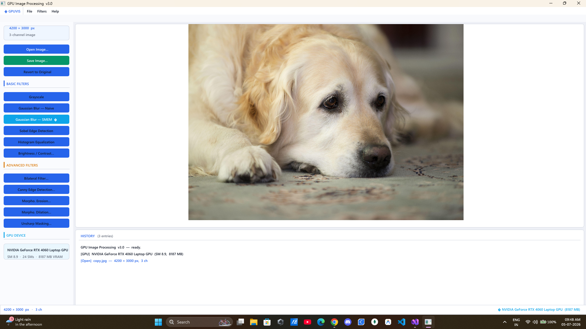
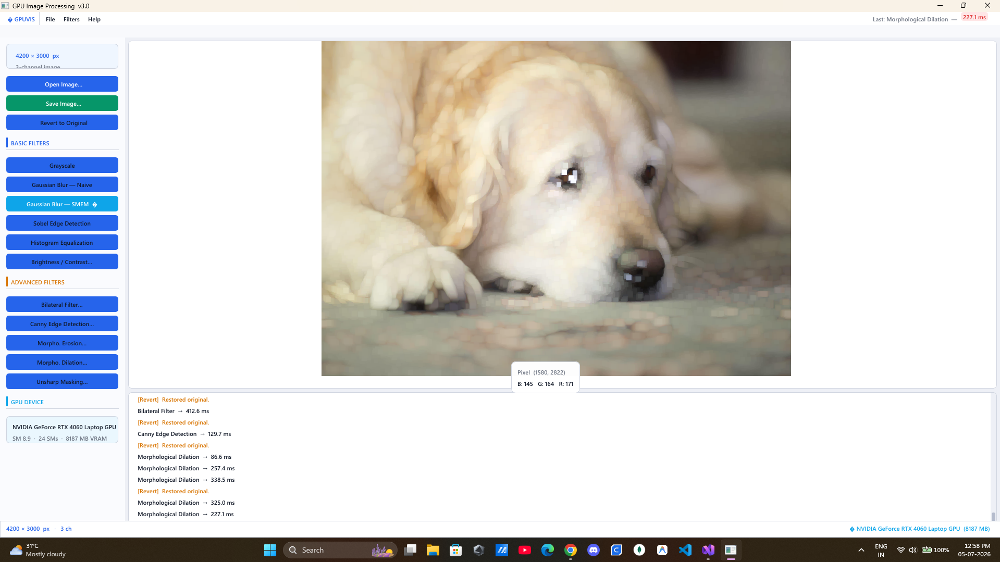
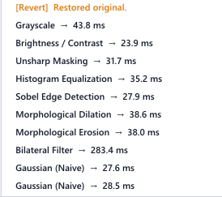

# GPU Image Processing Suite — CUDA + OpenCV + Dear ImGui

A real-time image processing desktop application built entirely around hand-written CUDA kernels. Every filter — from grayscale conversion to a full 5-pass Canny edge detector — runs on the GPU, with a Dear ImGui / DirectX 11 interface for loading images, tuning parameters live, and watching GPU execution time update in the log as you go.



This started as a six-week summer internship project (see `Summer_Internship_Report.docx` in this repo for the full write-up, methodology, and performance analysis).

---

## Table of Contents

- [Features](#features)
- [Screenshots](#screenshots)
- [Architecture](#architecture)
- [Requirements](#requirements)
- [Installation](#installation)
  - [1. Clone the repository](#1-clone-the-repository)
  - [2. Install the CUDA Toolkit](#2-install-the-cuda-toolkit)
  - [3. Install OpenCV](#3-install-opencv)
  - [4. Add Dear ImGui](#4-add-dear-imgui)
  - [5. Configure the Visual Studio project](#5-configure-the-visual-studio-project)
  - [6. Build](#6-build)
  - [7. Run](#7-run)
- [Usage](#usage)
- [Project Structure](#project-structure)
- [Filter Reference](#filter-reference)
- [Performance Notes](#performance-notes)
- [Known Limitations / Future Work](#known-limitations--future-work)
- [References](#references)


---

## Features

- **11 CUDA kernels**, covering point operations, convolutions, gradient-based edge detection, histogram-based operations, and rank-based morphology.
- **Naive vs. shared-memory Gaussian blur**, implemented side-by-side as a deliberate case study in memory-bandwidth-bound GPU performance.
- **Full multi-pass Canny edge detector** running entirely on-device (pre-blur → gradient → non-max suppression → double threshold → iterative hysteresis → cleanup), with no CPU round-trip between passes.
- **Interactive Dear ImGui interface**: sidebar filter buttons, live image preview with pixel-value hover inspection, modal dialogs for parameterized filters (Canny thresholds, bilateral sigmas, morphology radius, unsharp strength, brightness/contrast), and a scrolling operation history log with per-call GPU timing.
- **GPU device panel** showing the detected CUDA device, compute capability, SM count, and VRAM.

## Screenshots

| | |
|---|---|
|  |  |
| Main window — image preview, sidebar, GPU info, and status bar | Filter sidebar — Basic and Advanced filter groups |


*Morphological Dilation applied to a test image — note the pixel-value tooltip on hover and the running operation history with per-call GPU timings on the right/below.*


*Close-up of the history log, showing measured GPU execution time (including memory transfer) for each filter call — useful for comparing cheap point operations against expensive per-pixel loops like the bilateral filter.*

## Architecture

The application is split into three layers:

```
┌─────────────────────────────────────────────┐
│  Presentation — Dear ImGui + Win32 + DX11    │   main.cpp (RenderUI, modals)
├─────────────────────────────────────────────┤
│  Host orchestration — state, kernel wrappers │   main.cpp (AppState, K*, RunKernel)
├─────────────────────────────────────────────┤
│  Device compute — CUDA kernels               │   kernel.cu / kernel.h
└─────────────────────────────────────────────┘
```

Every filter follows the same seven-step workflow: click → allocate device buffers → copy image to device → launch kernel(s) → synchronize → copy result back → free buffers → refresh the on-screen texture. Canny is the one exception, expanding the "launch kernel" step into its own five-pass sub-pipeline.

## Requirements

| Component | Version used in this project |
|---|---|
| OS | Windows 10/11 (x64) |
| IDE | Visual Studio 2022 (toolset `v145`) |
| CUDA Toolkit | 13.3 |
| GPU | Any NVIDIA GPU, compute capability 3.0+ (project ships pre-configured for `sm_89` — see [Configure](#5-configure-the-visual-studio-project) to change this) |
| OpenCV | 4.12.0 (`opencv_world4120.lib`) |
| GUI | Dear ImGui (Win32 + DirectX 11 backends) |
| Graphics API | DirectX 11 (`d3d11.lib`, `dxgi.lib`, `d3dcompiler.lib`) |

> You do **not** need an NVIDIA GPU with exactly SM 8.9 — you just need to change the `CodeGeneration` target in the project properties to match your card (see step 5).

## Installation

### 1. Clone the repository

```bash
git clone https://github.com/SaikatxAlpha/GPU_Image_Processing.git
cd GPU_Image_Processing
```

### 2. Install the CUDA Toolkit

Download and install **CUDA Toolkit 13.3** from NVIDIA:
https://developer.nvidia.com/cuda-downloads

During installation, make sure the **Visual Studio Integration** component is checked — this installs the `BuildCustomizations\CUDA 13.3.props/.targets` files the `.vcxproj` depends on. Confirm afterward that this path exists:

```
C:\Program Files\NVIDIA GPU Computing Toolkit\CUDA\v13.3\lib\x64
```

If you install a different CUDA version, update the `CodeGeneration`/import paths as described in step 5.

### 3. Install OpenCV

The project expects a prebuilt OpenCV (VC16, x64) at:

```
D:\OpenCV\opencv\build\include
D:\OpenCV\opencv\build\x64\vc16\lib
```

You can either:
- **Match this layout**: download OpenCV 4.12.0 from https://opencv.org/releases/, extract it to `D:\OpenCV\opencv`, and you're done, or
- **Use your own path**: extract OpenCV anywhere, then open the `.vcxproj` in a text editor (or via Visual Studio → Project Properties) and update every occurrence of `D:\OpenCV\opencv\build\...` to point at your install location, for both the `Debug|x64` and `Release|x64` configurations.

The linker expects `opencv_world4120.lib`; if your OpenCV build uses a different version suffix (e.g. `opencv_world4110.lib`), update `AdditionalDependencies` in Project Properties → Linker → Input accordingly.

### 4. Add Dear ImGui

Dear ImGui's source isn't vendored in this repo — pull it in manually:

1. Download the source from https://github.com/ocornut/imgui (Code → Download ZIP, or clone it).
2. Copy the following files into the project folder, next to `main.cpp`:
   ```
   imgui.h            imgui.cpp
   imgui_draw.cpp     imgui_tables.cpp     imgui_widgets.cpp
   imgui_internal.h   imconfig.h
   imstb_rectpack.h   imstb_textedit.h     imstb_truetype.h
   ```
3. From ImGui's `backends/` subfolder, also copy:
   ```
   imgui_impl_win32.h   imgui_impl_win32.cpp
   imgui_impl_dx11.h    imgui_impl_dx11.cpp
   ```
4. In Visual Studio: **Project → Add Existing Item…** and select all the `.cpp`/`.h` files above (the `.vcxproj` already lists the core ImGui + backend files as expected source files, so Visual Studio will pick them up once they exist on disk).

### 5. Configure the Visual Studio project

1. Open **`GPUImageProcessingFinal.slnx`** in Visual Studio 2022.
2. Set the solution configuration to **x64** (Debug or Release).
3. If your GPU isn't compute capability 8.9, update the target architecture:
   - Right-click the project → **Properties → CUDA C/C++ → Device → Code Generation**
   - Replace `compute_89,sm_89` with the value matching your GPU (e.g. `compute_75,sm_75` for a Turing card, `compute_86,sm_86` for Ampere consumer cards). You can find your compute capability at https://developer.nvidia.com/cuda-gpus.
4. Double-check **Properties → VC++ Directories** (or the raw `IncludePath`/`AdditionalLibraryDirectories` in the `.vcxproj`) point at your OpenCV and CUDA install locations from steps 2–3.
5. Confirm **Properties → Linker → System → SubSystem** is set to **Windows** (the app has no console window by design).

### 6. Build

- Select **Release | x64** (or Debug | x64 for development) and build (**Ctrl+Shift+B**).
- The CUDA kernel file (`kernel.cu`) compiles via NVCC; everything else compiles via MSVC. If the build fails on missing ImGui symbols, double check step 4; if it fails on OpenCV headers, double check step 3.

### 7. Run

Run the produced `GPUImageProcessingFinal.exe`. On first launch you should see the GPU device panel populate at the bottom of the sidebar — if it says **"No CUDA GPU detected"**, confirm your NVIDIA driver is installed and up to date.

## Usage

1. **File → Open Image…** (or `Ctrl+O`) to load a `.png`, `.jpg`, `.jpeg`, `.bmp`, `.tif`, or `.tiff` file.
2. Click any filter in the **Basic Filters** or **Advanced Filters** section of the sidebar. Filters that need parameters (Brightness/Contrast, Bilateral, Canny, Erosion, Dilation, Unsharp Masking) open a modal dialog with sliders — adjust and click **Apply**.
3. Hover over the image to see the BGR (or grayscale) value at that pixel.
4. **File → Revert to Original** restores the initially loaded image at any point.
5. **File → Save Image…** (or `Ctrl+S`) exports the current result.
6. Every operation's GPU execution time is appended to the **History** log at the bottom of the window.

## Project Structure

```
GPUImageProcessingFinal/
├── kernel.cu                        # All CUDA __global__ kernels + host launcher functions
├── kernel.h                         # Launcher declarations (the public API kernel.cu exposes to main.cpp)
├── main.cpp                         # App state, kernel wrapper functions, Dear ImGui/DX11 UI
├── GPUImageProcessingFinal.vcxproj  # Visual Studio / MSBuild project file
└── (imgui.*, imgui_impl_*.*, etc.)  # Dear ImGui sources — added manually, see step 4
GPUImageProcessingFinal.slnx         # Solution file
Summer_Internship_Report.docx        # Full project report: design rationale, literature review, benchmarks
```

## Filter Reference

| Filter | Key Technique | Adjustable Parameters |
|---|---|---|
| Grayscale | BT.601 weighted sum (0.299R + 0.587G + 0.114B) | None |
| Gaussian Blur — Naive | Global-memory reads, constant-memory kernel weights | None (fixed 5×5) |
| Gaussian Blur — SMEM ★ | Shared-memory tiling with 2-pixel halo | None (fixed 5×5) |
| Sobel Edge Detection | Gradient magnitude, fixed 3×3 kernel | None |
| Brightness / Contrast | Per-pixel affine transform: `clamp(alpha·in + beta, 0, 255)` | alpha, beta |
| Histogram Equalization | GPU histogram (atomicAdd) + CPU CDF/LUT + GPU remap | None |
| Bilateral Filter | Spatial × range Gaussian weighting (edge-preserving) | sigma_s, sigma_r |
| Canny Edge Detection | 5-pass GPU pipeline with iterative hysteresis convergence | low / high threshold |
| Morphological Erosion | Minimum over a square structuring element | radius |
| Morphological Dilation | Maximum over a square structuring element | radius |
| Unsharp Masking | `clamp(in + strength·(in − GaussianBlur(in)), 0, 255)` | strength |

All CUDA kernels launch with 16×16 thread blocks and use clamp-to-edge border handling. Full technical rationale for each design choice — including why shared-memory tiling doesn't extend cleanly to the bilateral filter, and how the Canny hysteresis flood-fill was reformulated as an iterative sweep-until-convergence kernel — is in Chapter 4 of the internship report.

## Performance Notes

- The shared-memory Gaussian blur was consistently faster than the naive global-memory version across test images, in line with the commonly cited 1.5–3× range for 5×5 convolution kernels, with the gap widening on larger images (bandwidth-bound behavior).
- Point operations (grayscale, brightness/contrast) are the cheapest by a wide margin.
- Morphological erosion/dilation cost scales with the square of the radius — clearly visible as the radius slider is increased.
- The bilateral filter is the most expensive single-pass filter, since it evaluates two exponentials per neighbouring pixel in the inner loop.
- Canny's iterative hysteresis step converges in a handful of sweeps for typical natural images, so the 5-pass pipeline doesn't feel disproportionately slow despite the unbounded worst case.
- Timings shown in the app include host-to-device/device-to-host memory copy and `cudaMalloc`/`cudaFree` overhead, not just kernel execution — see the report for the reasoning behind that choice.

## Known Limitations / Future Work

- **No persistent device buffers** — every filter call allocates and frees its own device memory rather than reusing a buffer across operations.
- **No CUDA Streams pipeline yet** — an async, non-synchronizing Gaussian blur launcher (`launchGaussianBlurSharedAsync`) is already in `kernel.cu` for this purpose, but a full multi-stream pipeline hasn't been built.
- **Still images only** — no video/webcam frame-by-frame processing.
- **No Nsight profiling** — timings are host-side wall-clock, not device-side occupancy/throughput metrics.
- **No median filter** or pyramid-based blur for large radii yet.

See Chapter 6.2 of the internship report for the full future-work discussion.

## References

1. NVIDIA Corporation, *CUDA C++ Programming Guide*.
2. NVIDIA Corporation, *CUDA C++ Best Practices Guide*.
3. R. C. Gonzalez and R. E. Woods, *Digital Image Processing*, 4th ed., Pearson, 2018.
4. J. Canny, "A Computational Approach to Edge Detection," *IEEE Transactions on Pattern Analysis and Machine Intelligence*, vol. PAMI-8, no. 6, pp. 679–698, 1986.
5. OpenCV Development Team, *OpenCV Documentation*, opencv.org.
6. Dear ImGui, https://github.com/ocornut/imgui.
7. C. Tomasi and R. Manduchi, "Bilateral Filtering for Gray and Color Images," *Proc. IEEE ICCV*, 1998.
